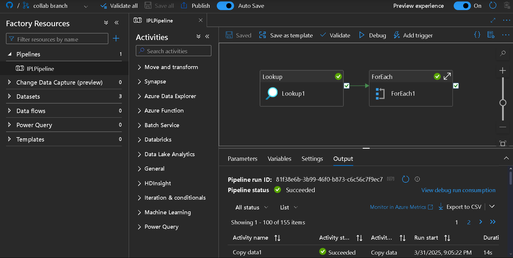
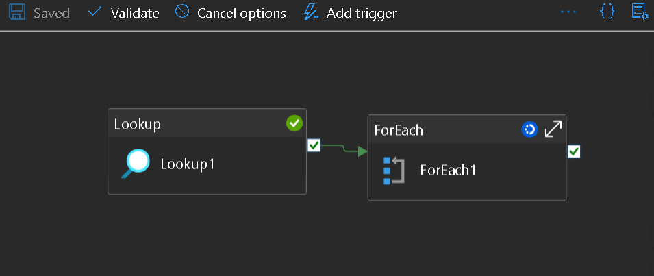
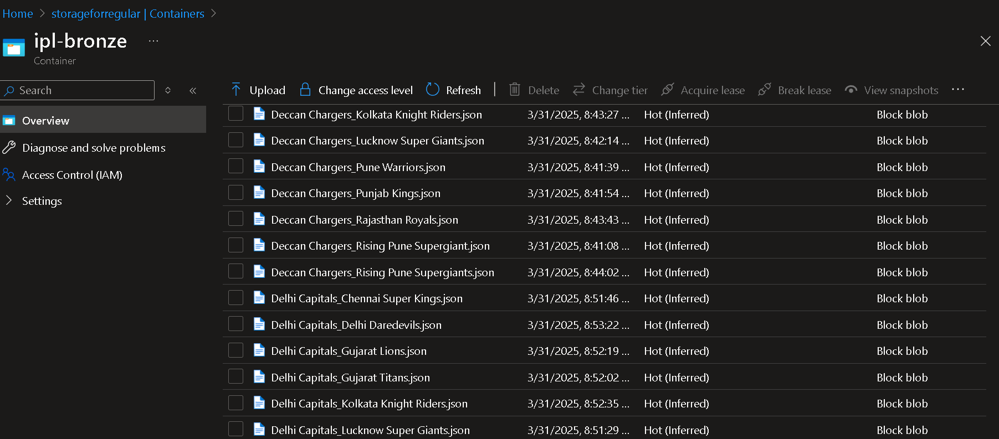
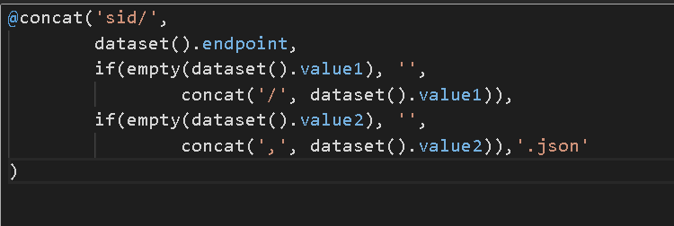
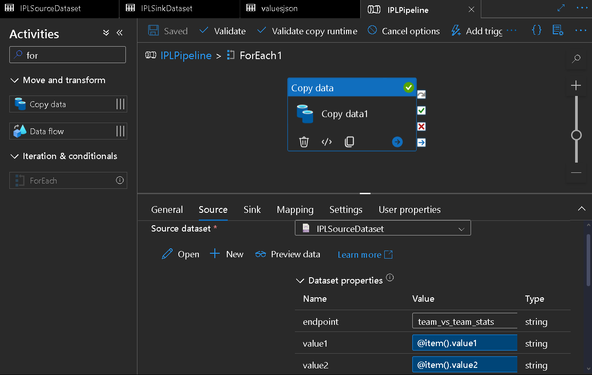
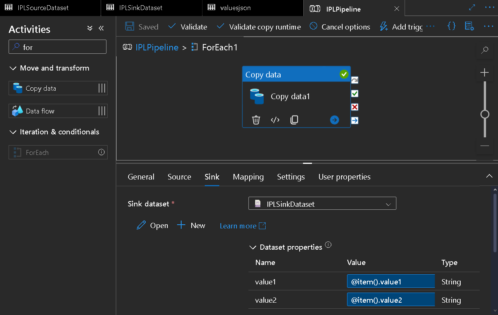

# 🚀 Dynamic Data Ingestion Pipeline with Azure Data Factory

## 📌 Objective
I built a **fully dynamic** pipeline in **Azure Data Factory (ADF)** that efficiently extracts data from an API with **parameterized endpoints** and stores it in **Azure Blob Storage**. Unlike static pipelines, this setup allows me to **dynamically change API parameters** and retrieve data **without modifying the pipeline structure**.

### 🌟 Why Dynamic Pipelines Matter?
In real-world data engineering, APIs often require **different parameters** based on the data needed. A static pipeline would mean creating a separate pipeline for each scenario—a **maintenance nightmare**! Instead, I designed a pipeline that **automates this process**, making it scalable and adaptable.



---

## ⚙️ How It Works

### 🔹 API Request Structure
The API follows a structured endpoint pattern:
```
/sid/{endpoint}/{value1},{value2}
```
- **`endpoint`** → Defines the type of data to fetch.
- **`value1` & `value2`** → Specifies the entities to compare or filter data.

For example:
```
/sid/team_vs_team_stats/Sunrisers Hyderabad,Chennai Super Kings
```

### 🔹 JSON File as Input 📂
I stored all required parameter combinations in a **JSON file** in **Azure Blob Storage**. ADF **reads** this file and iterates over its values using a **Lookup & ForEach** activity.



### 🔹 Copy Activity & Storage 🏗️
For each API call, data is extracted and saved into **Azure Blob Storage** with **structured filenames**:
```
<value1>_<value2>.json
```
For example:
```
Sunrisers Hyderabad_Chennai Super Kings.json
```
This ensures **clarity, easy retrieval, and organized storage**.



---

## 🚧 Challenges Faced & Solutions 🛠️

### ❌ Issue: API Required Different Numbers of Parameters
**✅ Solution:** I structured my pipeline to handle all cases dynamically:
- If `value1` or `value2` **does not exist**, it is set to `null`.
- The **relative URL is dynamically generated** using an expression:
  ```
  @concat('sid/',
        dataset().endpoint,
        if(empty(dataset().value1), '',
                concat('/', dataset().value1)),
        if(empty(dataset().value2), '',
                concat(',', dataset().value2)),'.json'
  )
  ```
  This ensures that the API is correctly called, whether it needs 0, 1, or 2 parameters.



### ❌ Issue: JSON Output Was Stored as 'file' Instead of .json
**✅ Solution:** Configured **Sink settings**:
- Set **File Format** to **JSON**.
- Explicitly defined file extension in **Copy Activity**.



### ❌ Issue: Pipeline Failing After Multiple Cancellations
**✅ Solution:** Checked **Integration Runtime (IR) Status**, restarted it if necessary, and **monitored pipeline execution logs**.



---

## 🔥 Best Practices Implemented
✅ **Dynamic URL Generation** → No hardcoded values; all API calls are parameterized.
✅ **Automated Iteration Using JSON File** → No manual modifications needed when new data points are added.
✅ **Organized File Naming** → Ensures easy access to stored datasets.
✅ **Lookup + ForEach Combination** → Efficiently loops through multiple API requests.


---

## 🎯 Final Thoughts
This **dynamic** pipeline is a game-changer! 🎯 Now, I can fetch data from multiple API endpoints **without modifying the pipeline**.

💡 **Future Enhancements:**
- Implement **Error Handling** for failed API requests.
- Automate **Trigger Scheduling** for periodic data ingestion.

🚀 **ADF is powerful**, but making it **dynamic** takes it to the next level! If you're working on API-based data extraction, **automation is key!** 🔥

---

💬 **Got questions?** Let’s connect! 😃

